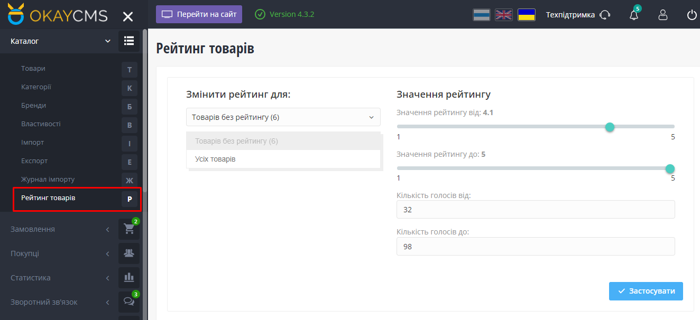

#  Настройка рейтинга для всех товаров

<b>Module RatingProduct - <a href="https://okay-cms.com/products/ratingproduct_1.0.0-ratingproduct" target="_blank">Маркетплейс</a></b>

Данный модуль позволяет настроить рейтинг и количество голосов для всех товаров в вашем магазине. Вы можете изменить рейтинг для всех товаров одновременно, или только для товаров, у которых еще не выставлен рейтинг. Также вы можете установить количество голосов для каждого товара.

# Результат работы модуля

# Зачем мне этот модуль?

Настройка рейтинга для всех товаров для OkayCMS представляет собой инструмент для улучшения позиций вашего интернет-магазина в поисковых системах, таких как Google. Так как рейтинг товаров является одним из ключевых факторов, влияющих на ранжирование страниц в выдаче поисковых систем. Благодаря модулю вы сократите время обновления рейтинга у товаров, особенно если у вас свыше 50 000 позиций.

